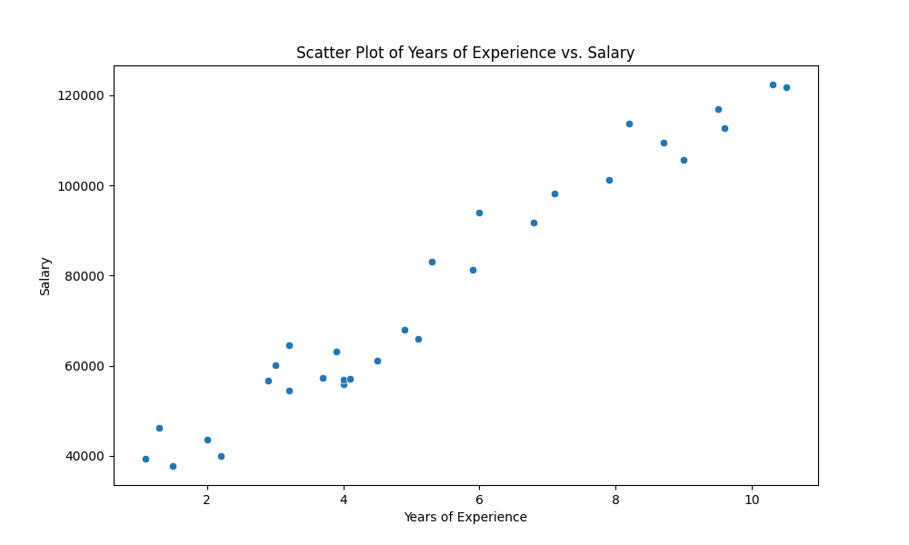
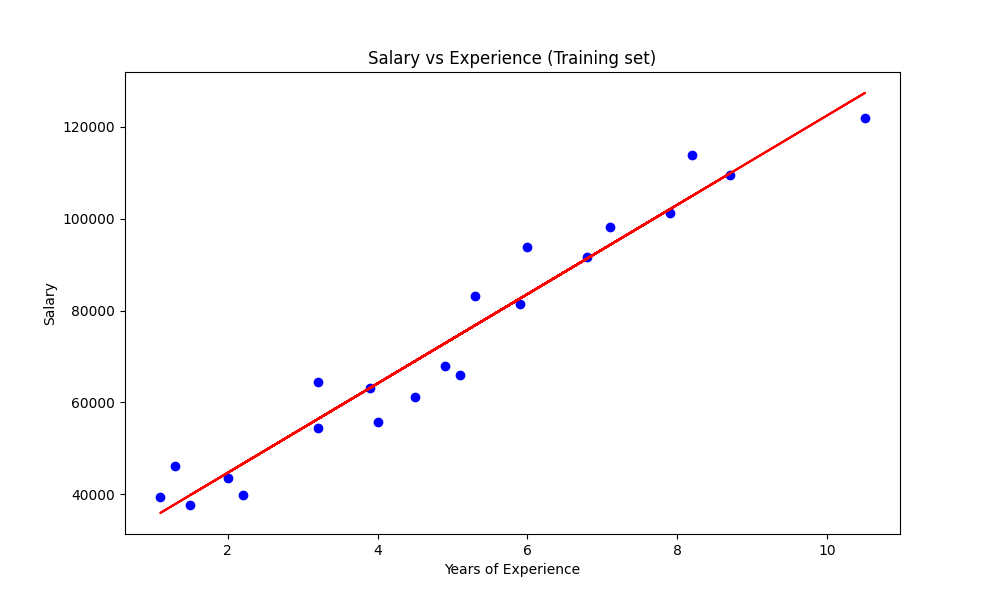
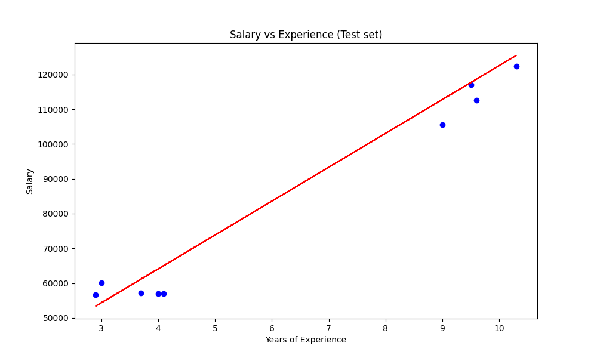
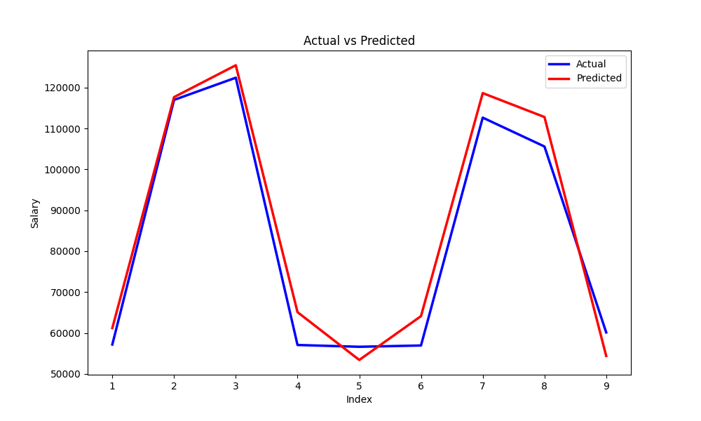
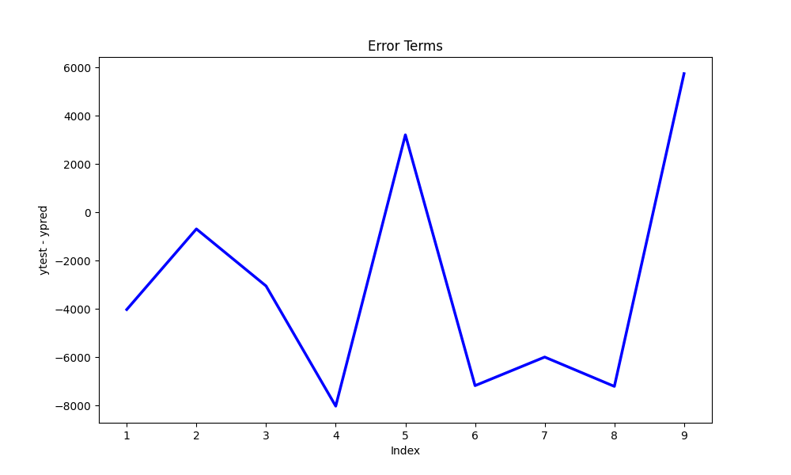
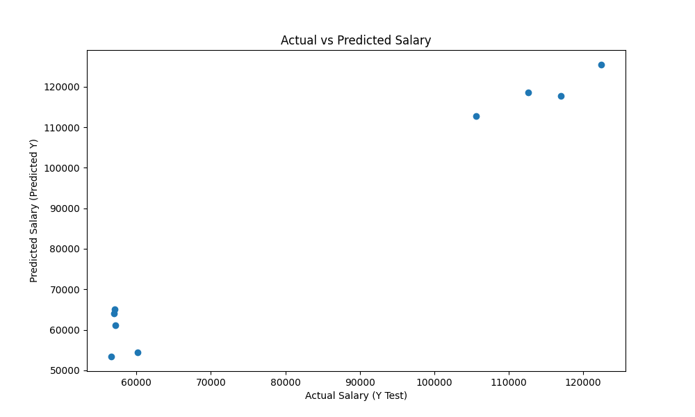

# Simple Linear Regression for Salary Data

This repository contains Python code for performing simple linear regression analysis on salary data. The code uses
the `numpy`, `pandas`, `matplotlib`, `seaborn`, and `scikit-learn` libraries to load, explore, visualize, and analyze
the dataset.

## Problem Statement

A company wants to hire a new employee and wants to predict the salary for the new employee based on the years of
experience the employee has. The company has the salary data for the past employees and wants to use the data to predict
the salary for the new employee.

## Data

The data is available in the file `Salary_Data.csv`. The data file has two columns, one for the years of experience and
the other for the salary.

## Objective

To predict the salary for the new employee based on the years of experience the employee has.

## Solution

### 0. Importing the Required Libraries

The code begins by importing the required libraries.

```python
import numpy as np
import pandas as pd
import matplotlib.pyplot as plt
import seaborn as sns
from sklearn.linear_model import LinearRegression
from sklearn.model_selection import train_test_split
from sklearn import metrics
```

### 1. Loading and Exploring the Dataset

The code begins by loading the dataset and providing an overview of its contents, including the first 5 rows, dataset
information, and summary statistics.

```python
# Load the dataset
data = pd.read_csv('Salary_Data.csv')

# Explore the dataset
print("First 5 rows of the dataset:")
print(data.head())

print("\nDataset information:")
print(data.info())

print("\nSummary statistics of the dataset:")
print(data.describe())
```

The output of the above code is shown below:

```text
First 5 rows of the dataset:
   YearsExperience   Salary
0              1.1  39343.0
1              1.3  46205.0
2              1.5  37731.0
3              2.0  43525.0
4              2.2  39891.0

Dataset information:
<class 'pandas.core.frame.DataFrame'>
RangeIndex: 30 entries, 0 to 29
Data columns (total 2 columns):
 #   Column           Non-Null Count  Dtype  
---  ------           --------------  -----  
 0   YearsExperience  30 non-null     float64
 1   Salary           30 non-null     float64
dtypes: float64(2)
memory usage: 612.0 bytes
None

Summary statistics of the dataset:
       YearsExperience         Salary
count        30.000000      30.000000
mean          5.313333   76003.000000
std           2.837888   27414.429785
min           1.100000   37731.000000
25%           3.200000   56720.750000
50%           4.700000   65237.000000
75%           7.700000  100544.750000
max          10.500000  122391.000000
```

### 2. Data Visualization

A scatter plot is created to visualize the relationship between years of experience and salary.

```python
# Visualize the data
plt.figure(figsize=(10, 6))
sns.scatterplot(x='YearsExperience', y='Salary', data=data)
plt.title('Scatter Plot of Years of Experience vs. Salary')
plt.xlabel('Years of Experience')
plt.ylabel('Salary')
plt.show()
```



### 3. Data Preparation

- The code extracts the 'YearsExperience' and 'Salary' columns from the dataset and prepares them as NumPy arrays.
- It splits the data into training and testing sets, using 70% for training and 30% for testing. The input
  data (`X_train` and `X_test`) is reshaped into 2D arrays as required by scikit-learn.

```python
# Prepare the data for training
# Extract the columns as arrays
X = data['YearsExperience'].values
y = data['Salary'].values

# Check the shapes of X and y (number of data points)
print("X shape:", X.shape)
print("y shape:", y.shape)

# Split the data into training and testing sets
# Use 70% of the data for training and 30% for testing (random_state=100 for reproducibility)
X_train, X_test, y_train, y_test = train_test_split(X, y, train_size=0.7, random_state=100)

# Reshape X_train and X_test to be 2D arrays
X_train = X_train.reshape(-1, 1)
X_test = X_test.reshape(-1, 1)
```

```text
X shape: (30,)
y shape: (30,)
```

### 4. Model Creation and Evaluation

- A linear regression model is created and trained on the training data.
- The coefficients and intercept of the trained model are displayed.
- The R-squared value is calculated and displayed for the training set.
- Predictions are made on the test set.

```python
# Create and train the linear regression model
model = LinearRegression()
model.fit(X_train, y_train)

# Model evaluation
# Display the coefficients (slope) and intercept (bias) of the trained model
print("Coefficients:", model.coef_)
print("Intercept:", model.intercept_)

# Calculate and display the R-squared value on the training set
print("R-squared (training set):", model.score(X_train, y_train))

# Make predictions on the test set
y_pred = model.predict(X_test)
```

```text
Coefficients: [9731.20383825]
Intercept: 25202.88778615486
R-squared (training set): 0.9489148127897334
```

### 5. Visualizing Model Performance

- Two scatter plots are created to visualize the model's performance on the training and test sets.
- An additional plot shows the actual vs. predicted values.
- Error terms are plotted to analyze the residuals.
- A scatter plot of actual vs. predicted values is generated.

```python
# Visualize the results on the training set
plt.figure(figsize=(10, 6))
plt.scatter(X_train, y_train, color='blue')
plt.plot(X_train, model.predict(X_train), color='red')
plt.title('Salary vs Experience (Training set)')
plt.xlabel('Years of Experience')
plt.ylabel('Salary')
plt.show()
```



```python
# Visualize the results on the test set
plt.figure(figsize=(10, 6))
plt.scatter(X_test, y_test, color='blue')
plt.plot(X_test, y_pred, color='red')
plt.title('Salary vs Experience (Test set)')
plt.xlabel('Years of Experience')
plt.ylabel('Salary')
plt.show()
```



```python
# Plot actual vs. predicted values
data_point_indices = [i for i in range(1, len(y_test) + 1, 1)]  # Generate indices for data points
plt.figure(figsize=(10, 6))
plt.plot(data_point_indices, y_test, color='blue', linewidth=2.5, linestyle='-', label='Actual')
plt.plot(data_point_indices, y_pred, color='red', linewidth=2.5, linestyle='-', label='Predicted')
plt.title('Actual vs Predicted')
plt.xlabel('Index')
plt.ylabel('Salary')
plt.legend()
plt.show()
```



```python
# Plot error terms
plt.figure(figsize=(10, 6))
plt.plot(data_point_indices, y_test - y_pred, color='blue', linewidth=2.5, linestyle='-')
plt.title('Error Terms')
plt.xlabel('Index')
plt.ylabel('ytest - ypred')
plt.show()
```



```python
# Scatter plot of actual vs. predicted values
plt.figure(figsize=(10, 6))
plt.scatter(y_test, y_pred)
plt.xlabel('Actual Salary (Y Test)')
plt.ylabel('Predicted Salary (Predicted Y)')
plt.title('Actual vs Predicted Salary')
plt.show()
```



### 6. Model Evaluation Metrics
The code calculates and displays the following evaluation metrics for the model:

- Mean Absolute Error (MAE)
- Mean Squared Error (MSE)
- Root Mean Squared Error (RMSE)
- R-squared Score

```python
# Model evaluation metrics
mae = metrics.mean_absolute_error(y_test, y_pred)
mse = metrics.mean_squared_error(y_test, y_pred)
rmse = np.sqrt(mse)
r2_score = metrics.r2_score(y_test, y_pred)

print('Mean Absolute Error (MAE):', mae)
print('Mean Squared Error (MSE):', mse)
print('Root Mean Squared Error (RMSE):', rmse)
print('R-squared Score:', r2_score)
```

```text
Mean Absolute Error (MAE): 5010.529885004963
Mean Squared Error (MSE): 30310299.043402553
Root Mean Squared Error (RMSE): 5505.4790021761555
R-squared Score: 0.9627668685473266
```

## Running the Code

1. Replace the file path in the following line of code with the path to the `Salary_Data.csv` file on your computer.
2. Ensure that the dataset contains columns with appropriate names (e.g., 'YearsExperience' and 'Salary').
3. Execute the code using a Python environment that has the required libraries installed.

## Dependencies
Make sure you have the following Python libraries installed:

- `numpy`
- `pandas`
- `matplotlib`
- `seaborn`
- `scikit-learn`

You can install them using pip if you don't have them already:

```bash
pip install numpy pandas matplotlib seaborn scikit-learn 
```

## References

- [Simple Linear Regression for Salary Data](https://www.kaggle.com/code/vivinbarath/simple-linear-regression-for-salary-data/notebook)
